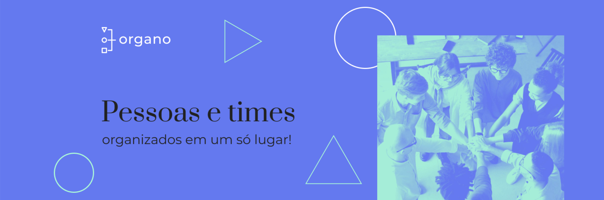

<table align="right">
  <tr>
    <td>
      <a href="README-EN.md">🇺🇸 English (apenas no GitHub)</a>
    </td>
  </tr>
  <tr>
    <td>
      <a href="README.md">🇧🇷 Português</a>
    </td>
  </tr>
</table>

# Organo

A Organo é um protótipo de uma aplicação de gerenciar times e colaboradores.

## 🔨 Recursos do projeto

Organo é um protótipo de gerenciador de times e colaboradores. Nele, você pode criar times, definir cores para cada time, adicionar e excluir colaboradores aos times, e até favoritá-los! Esse projeto frisa a componentização, além de trabalhar com formulários, explora a ideia de uma aplicação e desenvolvimento do input do type `color`.

## ⚙️ Técnicas e tecnologias usadas

Confira essa lista de tudo que vamos usar nesse app:

- `React`
- `Create React App`
- `JavaScript`
- `HTML`
- `CSS`
- `GitHub`

## 🛠️ Abra e execute o projeto

Para abrir e executar o projeto, execute `npm i` para instalar as dependências e `npm start` para iniciar o projeto.

Em seguida, vá para <a href="http://localhost:3000/">http://localhost:3000/</a> em seu navegador.

## 📚 Mais informações do tutorial

Organo é um protótipo de uma aplicação de gerenciar times e colaboradores, desenvolvido a partir do curso de [React: como os componentes funcionam](https://cursos.alura.com.br/course/react-componentes-funcionam). Fazendo esse curso de react fui capaz de:

- Aprender a clonar um projeto existente no GitHub, instalar as dependências necessárias e rodar o código;
- Entender o que são dependências e como instalar novas dependências;
- Comparar como o React vê um componente, assim como seus props e states;
- Fazer mudanças no código, como criação de novas features e refatoração de código existente;
- Saber o que é one-way data binding, e o que isto tem a ver com VirtualDOM (e por que o React é feito desta forma)

A didática é excepcional, e contribuiu demais com o meu entendimento mais abstrato de como o React funciona, e cada vez estou mais apaixonado por ele.

| :placard: Vitrine.Dev |                                                                                |
| --------------------- | ------------------------------------------------------------------------------ |
| :sparkles: Nome       | **Organo**                                                                     |
| :label: Tecnologias   | React, Create React App, JavaScript,HTML, CSS, GitHub (tecnologias utilizadas) |
| :rocket: URL          | https://organo-cristianmeelo.vercel.app/                                       |
| :fire: Desafio        | https://cursos.alura.com.br/course/react-componentes-funcionam                 |
